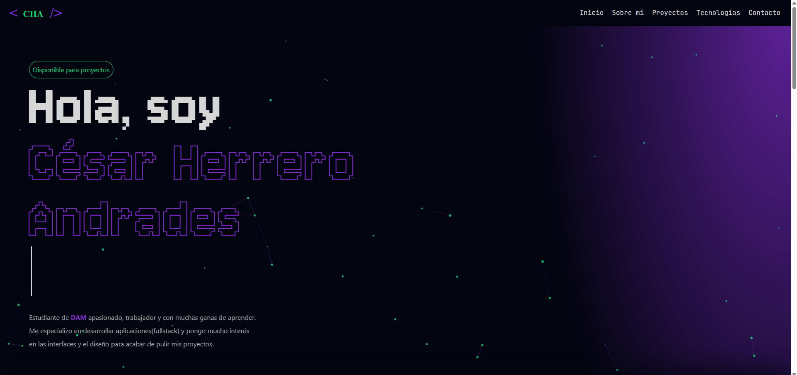
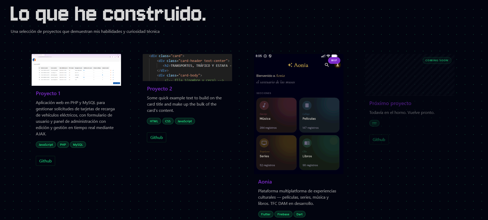
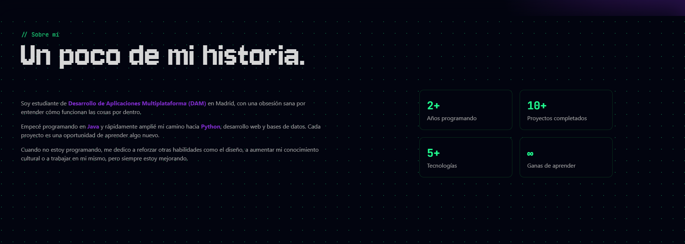

# 🌐 Portfolio Web Personal

Portfolio web desarrollado con HTML, CSS, Bootstrap y JavaScript.

Diseñado para presentar mi perfil como desarrollador junior, mostrando proyectos, tecnologías y formas de contacto de manera clara y visual.

---

## 🧠 Características

- Diseño responsive
- Interfaz moderna y visual
- Animación interactiva con Canvas (JavaScript puro)
- Navegación fluida entre secciones
- Integración con GitHub, LinkedIn y correo

---

## 🛠️ Tecnologías

- HTML5
- CSS3
- Bootstrap
- JavaScript (vanilla)

---

## 🎨 Animación destacada

El fondo interactivo está implementado desde cero utilizando Canvas, generando partículas dinámicas que reaccionan al movimiento del ratón.

---

## 📸 Capturas

### Inicio

### Proyectos

### Sobre mí

---

## 🚀 Demo

Puedes ver la web aquí:

👉 https://TU-USUARIO.github.io/portfolio/

---

## 📂 Estructura

index.html
assets/
    css/
    js/
    images/
    svg/
docs/
    screenshots/

---

## 📌 Autor

Desarrollado como portfolio personal dentro del ciclo DAM.